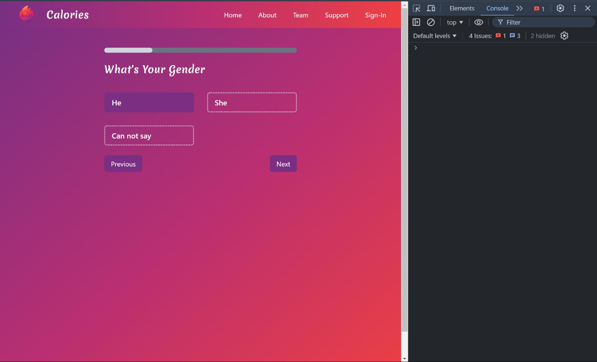
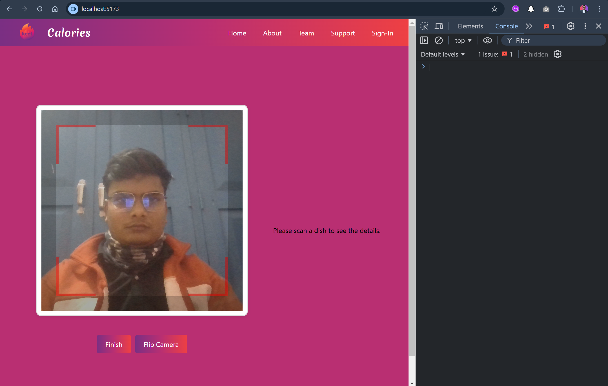

# Calorie Tracker App

## Overview

The **Calorie Tracker** app allows users to scan food items using QR codes, track their calorie intake, and receive guidance on maintaining their health based on their dietary habits. With the help of QR code scanning, users can easily get information about the food they consume and monitor their health goals.





## Features

- **QR Code Scanning**: Scan food items using the camera to fetch information about them.
- **Calorie Tracking**: Track the total calories consumed based on scanned food items.
- **Health Guidance**: Receive personalized health tips and guidance on maintaining a balanced diet.

## Tech Stack

### Frontend

- **React**: A JavaScript library for building user interfaces.
- **Axios**: A promise-based HTTP client for making requests to the server.
- **React Router**: For routing and navigation within the app.
- **QR Scanner**: `@yudiel/react-qr-scanner` for scanning food QR codes.
- **React Icons**: For using various icons in the app.

### Backend

- **Express**: A web framework for building APIs in Node.js.
- **MongoDB (Mongoose)**: Database for storing food data and user information.
- **Body-Parser**: Middleware for parsing incoming request bodies.
- **CORS**: Middleware for handling cross-origin requests.
- **Nodemon**: A tool for automatically restarting the server during development.

## Installation

### Frontend

1. Clone the repository:

   ```bash
   git clone git@github.com:utkarsh032/calorie-tracker.git
   cd calorie-tracker/client

   npm install

   npm run dev
   ```

### Backend

```bash
cd calorie-tracker/server

npm install

npm run dev

```
